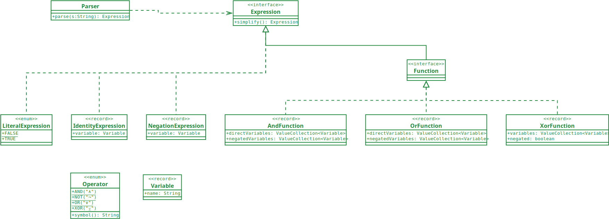

# Iterative Algebraic Collision Attack in Java

- [Getting Started](#getting-started)
- [Produce a Boolean Function](#produce-a-boolean-function)
  - [Produce ADD](#produce-add)
  - [Produce AND](#produce-and)
  - [Produce MD5](#produce-md5)
  - [Produce OR](#produce-or)
  - [Produce ROTATE](#produce-rotate)
  - [Produce SHIFT](#produce-shift)
  - [Produce XOR](#produce-xor)
- [Resolve a Boolean Function](#resolve-a-boolean-function)
  - [Resolve Literals](#resolve-literals)
  - [Resolve Identity](#resolve-identity)
  - [Resolve Negation](#resolve-negation)
  - [Resolve And](#resolve-and)
  - [Resolve Or](#resolve-or)
  - [Resolve Xor](#resolve-xor)
- [Report on the Complexity of a Boolean Function](#report-on-the-complexity-of-a-boolean-function)
- [Attack a Boolean Function](#attack-a-boolean-function)
- [Technical Documentation](#technical-documentation)

## Getting Started

First of all, you need to obtain a copy of the source code and compile it into an executable. Run the following commands
to do this:

```
git clone git@github.com:filipvanlaenen/iacaj.git
cd iacaj
mvn clean compile assembly:single
```

If everything works well, you'll finda JAR file in the `target` directory with all dependencies included. Let's test it
out producing a simple Boolean function ORing the first half of the input parameters with the second half:

```
java -jar iacaj-1.0-SNAPSHOT-jar-with-dependencies.jar produce OR 4
```

This should produce the following output:

```
v1 = i1 ∨ i5
v2 = i2 ∨ i6
v3 = i3 ∨ i7
v4 = i4 ∨ i8
o1 = v1
o2 = v2
o3 = v3
o4 = v4
```

The sections below explain how to use the tool to perform different actions.

## Produce a Boolean Function

Use the `produce` command to produce a Boolean function for a cryptographic hash function, or one of the trivial sample
Boolean functions. The trivial functions are added for testing purposes. Currently, the following functions can be
produced:

- [Produce ADD](#produce-add)
- [Produce AND](#produce-and)
- [Produce MD5](#produce-md5)
- [Produce OR](#produce-or)
- [Produce ROTATE](#produce-rotate)
- [Produce SHIFT](#produce-shift)
- [Produce XOR](#produce-xor)

### Produce ADD

The following commands produce Boolean functions ADDing the first half of the input parameters with the second half:

```
java -jar iacaj-1.0-SNAPSHOT-jar-with-dependencies.jar produce ADD
java -jar iacaj-1.0-SNAPSHOT-jar-with-dependencies.jar produce ADD ADD32.bf
java -jar iacaj-1.0-SNAPSHOT-jar-with-dependencies.jar produce ADD ADD32.java
java -jar iacaj-1.0-SNAPSHOT-jar-with-dependencies.jar produce ADD 4
java -jar iacaj-1.0-SNAPSHOT-jar-with-dependencies.jar produce ADD 4 ADD4.bf
```

If no parameters are provided, a word length of 32 is used and the output is printed out on the command line. If a file
name is provided, the result will be written to the file. If a numeric parameter is provided first, it will be used as
the word length. 

### Produce AND

The following commands produce Boolean functions ANDing the first half of the input parameters with the second half:

```
java -jar iacaj-1.0-SNAPSHOT-jar-with-dependencies.jar produce AND
java -jar iacaj-1.0-SNAPSHOT-jar-with-dependencies.jar produce AND AND32.bf
java -jar iacaj-1.0-SNAPSHOT-jar-with-dependencies.jar produce AND AND32.java
java -jar iacaj-1.0-SNAPSHOT-jar-with-dependencies.jar produce AND 4
java -jar iacaj-1.0-SNAPSHOT-jar-with-dependencies.jar produce AND 4 AND4.bf
```

If no parameters are provided, a word length of 32 is used and the output is printed out on the command line. If a file
name is provided, the result will be written to the file. If a numeric parameter is provided first, it will be used as
the word length. 

### Produce MD5

To produce a full version of the MD5 hash function, and have it printed out on the command line, use the following
command:

```
java -jar iacaj-1.0-SNAPSHOT-jar-with-dependencies.jar produce MD5
```

For a reduced version of the hash function, add the number of rounds as the second argument, e.g. 32:

```
java -jar iacaj-1.0-SNAPSHOT-jar-with-dependencies.jar produce MD5 32
```

Adding a third paramerer will also restrict the number of output bits:

```
java -jar iacaj-1.0-SNAPSHOT-jar-with-dependencies.jar produce MD5 32 16
```

If you specify a file name at the end, the Boolean function will be written to that file:

```
java -jar iacaj-1.0-SNAPSHOT-jar-with-dependencies.jar produce MD5 MD5.bf
java -jar iacaj-1.0-SNAPSHOT-jar-with-dependencies.jar produce MD5 32 MD5-R32.bf
java -jar iacaj-1.0-SNAPSHOT-jar-with-dependencies.jar produce MD5 32 16 MD5-R32-16.bf
```

### Produce OR

The following commands produce Boolean functions ORing the first half of the input parameters with the second half:

```
java -jar iacaj-1.0-SNAPSHOT-jar-with-dependencies.jar produce OR
java -jar iacaj-1.0-SNAPSHOT-jar-with-dependencies.jar produce OR OR32.bf
java -jar iacaj-1.0-SNAPSHOT-jar-with-dependencies.jar produce OR OR32.java
java -jar iacaj-1.0-SNAPSHOT-jar-with-dependencies.jar produce OR 4
java -jar iacaj-1.0-SNAPSHOT-jar-with-dependencies.jar produce OR 4 OR4.bf
```

If no parameters are provided, a word length of 32 is used and the output is printed out on the command line. If a file
name is provided, the result will be written to the file. If a numeric parameter is provided first, it will be used as
the word length. 

### Produce ROTATE

The following commands produce Boolean functions rotating the input parameters to the right:

```
java -jar iacaj-1.0-SNAPSHOT-jar-with-dependencies.jar produce ROTATE
java -jar iacaj-1.0-SNAPSHOT-jar-with-dependencies.jar produce ROTATE ROTATE32.bf
java -jar iacaj-1.0-SNAPSHOT-jar-with-dependencies.jar produce ROTATE ROTATE32.java
java -jar iacaj-1.0-SNAPSHOT-jar-with-dependencies.jar produce ROTATE 4
java -jar iacaj-1.0-SNAPSHOT-jar-with-dependencies.jar produce ROTATE 4 ROTATE4.bf
java -jar iacaj-1.0-SNAPSHOT-jar-with-dependencies.jar produce ROTATE 4 1
java -jar iacaj-1.0-SNAPSHOT-jar-with-dependencies.jar produce ROTATE 4 1 ROTATE4-1.bf
java -jar iacaj-1.0-SNAPSHOT-jar-with-dependencies.jar produce ROTATE 4 -1
```

If no parameters are provided, a word length of 32 is used and the output is printed out on the command line. If a file
name is provided, the result will be written to the file. If a numeric parameter is provided first, it will be used as
the word length. A second numeric parameter will be used as the number of positions to rotate the input parameters.

### Produce SHIFT

The following commands produce Boolean functions shifting the input parameters to the right:

```
java -jar iacaj-1.0-SNAPSHOT-jar-with-dependencies.jar produce SHIFT
java -jar iacaj-1.0-SNAPSHOT-jar-with-dependencies.jar produce SHIFT SHIFT32.bf
java -jar iacaj-1.0-SNAPSHOT-jar-with-dependencies.jar produce SHIFT SHIFT32.java
java -jar iacaj-1.0-SNAPSHOT-jar-with-dependencies.jar produce SHIFT 4
java -jar iacaj-1.0-SNAPSHOT-jar-with-dependencies.jar produce SHIFT 4 SHIFT4.bf
java -jar iacaj-1.0-SNAPSHOT-jar-with-dependencies.jar produce SHIFT 4 1
java -jar iacaj-1.0-SNAPSHOT-jar-with-dependencies.jar produce SHIFT 4 1 SHIFT4-1.bf
java -jar iacaj-1.0-SNAPSHOT-jar-with-dependencies.jar produce SHIFT 4 -1
```

If no parameters are provided, a word length of 32 is used and the output is printed out on the command line. If a file
name is provided, the result will be written to the file. If a numeric parameter is provided first, it will be used as
the word length. A second numeric parameter will be used as the number of positions to shift the input parameters.

### Produce XOR

The following commands produce Boolean functions XORing the first half of the input parameters with the second half:

```
java -jar iacaj-1.0-SNAPSHOT-jar-with-dependencies.jar produce XOR
java -jar iacaj-1.0-SNAPSHOT-jar-with-dependencies.jar produce XOR XOR32.bf
java -jar iacaj-1.0-SNAPSHOT-jar-with-dependencies.jar produce XOR XOR32.java
java -jar iacaj-1.0-SNAPSHOT-jar-with-dependencies.jar produce XOR 4
java -jar iacaj-1.0-SNAPSHOT-jar-with-dependencies.jar produce XOR 4 XOR4.bf
```

If no parameters are provided, a word length of 32 is used and the output is printed out on the command line. If a file
name is provided, the result will be written to the file. If a numeric parameter is provided first, it will be used as
the word length. 

## Resolve a Boolean Function

The resolver uses the logical rules to resolve a vectorial boolean function as described in the sections below:

- [Resolve Literals](#resolve-literals)
- [Resolve Identity](#resolve-identity)
- [Resolve Negation](#resolve-negation)
- [Resolve And](#resolve-and)
- [Resolve Or](#resolve-or)
- [Resolve Xor](#resolve-xor)

### Resolve Literals

```
a = false ⇒ a = false

a = true  ⇒ a = true
```

### Resolve Identity

```
a = true
b = a     ⇒ b = true

a = false
b = a     ⇒ b = false

b = a   
c = b     ⇒ c = a

b = ¬a   
c = b     ⇒ c = ¬a

c = a ∧ b
d = c     ⇒ d = a ∧ b

c = a ∨ b
d = c     ⇒ d = a ∨ b

c = a ⊻ b
d = c     ⇒ d = a ⊻ b
```

### Resolve Negation

```
a = true
b = ¬a    ⇒ b = false

a = false
b = ¬a    ⇒ b = true

b = a   
c = ¬b    ⇒ c = ¬a

b = ¬a   
c = ¬b    ⇒ c = a

c = a ∧ b
d = ¬c    ⇒ d = ¬a ∨ ¬b

c = a ∨ b
d = ¬c    ⇒ d = ¬a ∧ ¬b

c = a ⊻ b
d = ¬c    ⇒ d = ¬a ⊻ b
```

### Resolve And

```
b = a ∧ a        ⇒ b = a

b = ¬a ∧ a       ⇒ b = false

c = a ∧ a ∧ b    ⇒ c = a ∧ b

c = ¬a ∧ a ∧ b   ⇒ c = false

a = false
b = false
c = a ∧ b        ⇒ c = false

a = false
b = true
c = a ∧ b        ⇒ c = false

a = true
b = true
c = a ∧ b        ⇒ c = true

a = false
b = false
c = ¬a ∧ b       ⇒ c = false

a = true
b = false
c = ¬a ∧ b       ⇒ c = false

a = false
b = true
c = ¬a ∧ b       ⇒ c = true

a = true
b = true
c = ¬a ∧ b       ⇒ c = false

a = false
c = a ∧ b        ⇒ c = false

a = true
c = a ∧ b        ⇒ c = b

a = false
c = ¬a ∧ b       ⇒ c = b

a = true
c = ¬a ∧ b       ⇒ c = false

a = false
c = a ∧ ¬b       ⇒ c = false

a = true
c = a ∧ ¬b       ⇒ c = ¬b

a = false
c = ¬a ∧ ¬b      ⇒ c = ¬b

a = true
c = ¬a ∧ ¬b      ⇒ c = false

b = a
d = b ∧ c        ⇒ d = a ∧ c

b = ¬a
d = b ∧ c        ⇒ d = ¬a ∧ c

b = a
d = ¬b ∧ c       ⇒ d = ¬a ∧ c

b = ¬a
d = ¬b ∧ c       ⇒ d = a ∧ c

c = a ∧ b
e = c ∧ d        ⇒ e = a ∧ b ∧ d

c = a ∧ ¬b
e = c ∧ d        ⇒ e = a ∧ ¬b ∧ d

c = a ∧ b
d = c ∧ b        ⇒ d = a ∧ b

c = a ∧ ¬b
d = c ∧ b        ⇒ d = false

c = a ∧ b
d = c ∧ ¬b       ⇒ d = false

c = a ∨ b
e = ¬c ∧ d       ⇒ e = ¬a ∧ ¬b ∧ d

d = a ∨ b ∨ c
e = a ∧ d        ⇒ e = a

d = a ∨ ¬b ∨ ¬c
e = a ∧ d        ⇒ e = a

d = a ∨ b ∨ ¬c
e = a ∧ d        ⇒ e = a

d = ¬a ∨ b ∨ c
e = ¬a ∧ d       ⇒ e = ¬a

d = ¬a ∨ ¬b ∨ ¬c
e = ¬a ∧ d       ⇒ e = ¬a

d = ¬a ∨ b ∨ ¬c
e = ¬a ∧ d       ⇒ e = ¬a

‡ c = ¬a ∨ b
‡ d = a ∧ c        ⇒ d = a ∧ b

‡ c = ¬a ∨ ¬b
‡ d = a ∧ c        ⇒ d = a ∧ ¬b

‡ d = ¬a ∨ b ∨ c   ⇒ f = b ∨ c
‡ e = a ∧ d        ⇒ e = a ∧ f

‡ d = ¬a ∨ ¬b ∨ ¬c ⇒ f = ¬b ∨ ¬c
‡ e = a ∧ d        ⇒ e = a ∧ f

‡ d = ¬a ∨ b ∨ ¬c  ⇒ f = b ∨ ¬c
‡ e = a ∧ d        ⇒ e = a ∧ f

‡ c = a ∨ b
‡ d = ¬a ∧ c        ⇒ d = ¬a ∧ b

‡ c = a ∨ ¬b
‡ d = ¬a ∧ c        ⇒ d = ¬a ∧ ¬b

‡ d = a ∨ b ∨ c   ⇒ f = b ∨ c
‡ e = ¬a ∧ d        ⇒ e  = ¬a ∧ f

‡ d = a ∨ ¬b ∨ ¬c ⇒ f = ¬b ∨ ¬c
‡ e = ¬a ∧ d        ⇒ e  = ¬a ∧ f

‡ d = a ∨ b ∨ ¬c  ⇒ f = b ∨ ¬c
‡ e = ¬a ∧ d        ⇒ e  = ¬a ∧ f

d = ¬a ∧ b ∧ c
e = a ∧ ¬d       ⇒ e = a

d = ¬a ∧ ¬b ∧ ¬c
e = a ∧ ¬d       ⇒ e = a

d = ¬a ∧ b ∧ ¬c
e = a ∧ ¬d       ⇒ e = a

d = a ∧ b ∧ c
e = ¬a ∧ ¬d      ⇒ e = ¬a

d = a ∧ ¬b ∧ ¬c
e = ¬a ∧ ¬d      ⇒ e = ¬a

d = a ∧ b ∧ ¬c
e = ¬a ∧ ¬d      ⇒ e = ¬a

‡ c = a ∧ b
‡ d = a ∧ ¬c        ⇒ d = a ∧ ¬b

‡ c = a ∧ ¬b
‡ d = a ∧ ¬c        ⇒ d = a ∧ ¬b

‡ d = a ∧ b ∧ c   ⇒ f = b ∧ c
‡ e = a ∧ ¬d        ⇒ e = a ∧ f

‡ d = a ∧ ¬b ∧ ¬c ⇒ f = ¬b ∨ ¬c
‡ e = a ∧ ¬d        ⇒ e = a ∧ f

‡ d = a ∧ b ∧ ¬c  ⇒ f = b ∨ ¬c
‡ e = a ∧ ¬d        ⇒ e = a ∧ f

‡ c = ¬a ∧ b
‡ d = ¬a ∧ ¬c        ⇒ d = ¬a ∧ b

‡ c = ¬a ∧ ¬b
‡ d = ¬a ∧ ¬c        ⇒ d = ¬a ∧ ¬b

‡ d = ¬a ∧ b ∧ c   ⇒ f = b ∨ c
‡ e = ¬a ∧ ¬d        ⇒ e  = ¬a ∧ f

‡ d = ¬a ∧ ¬b ∧ ¬c ⇒ f = ¬b ∨ ¬c
‡ e = ¬a ∧ ¬d        ⇒ e  = ¬a ∧ f

‡ d = ¬a ∧ b ∧ ¬c  ⇒ f = b ∨ ¬c
‡ e = ¬a ∧ ¬d        ⇒ e  = ¬a ∧ f
```

### Resolve Or

```
b = a ∨ a      ⇒ b = a

b = ¬a ∨ a     ⇒ b = true

c = a ∨ a ∨ b  ⇒ c = a ∨ b

c = ¬a ∨ a ∨ b ⇒ c = true

a = false
b = false
c = a ∨ b      ⇒ c = false

a = false
b = true
c = a ∨ b      ⇒ c = true

a = true
b = true
c = a ∨ b      ⇒ c = true

a = false
b = false
c = ¬a ∨ b     ⇒ c = true

a = true
b = false
c = ¬a ∨ b     ⇒ c = false

a = false
b = true
c = ¬a ∨ b     ⇒ c = true

a = true
b = true
c = ¬a ∨ b     ⇒ c = true

a = false
c = a ∨ b      ⇒ c = b

a = true
c = a ∨ b      ⇒ c = true

a = false
c = ¬a ∨ b     ⇒ c = true

a = true
c = ¬a ∨ b     ⇒ c = b

a = false
c = a ∨ ¬b     ⇒ c = ¬b

a = true
c = a ∨ ¬b     ⇒ c = true

a = false
c = ¬a ∨ ¬b    ⇒ c = true

a = true
c = ¬a ∨ ¬b    ⇒ c = ¬b

b = a
d = b ∨ c      ⇒ d = a ∨ c

b = ¬a
d = b ∨ c      ⇒ d = ¬a ∨ c

b = a
d = ¬b ∨ c     ⇒ d = ¬a ∨ c

b = ¬a
d = ¬b ∨ c     ⇒ d = a ∨ c

c = a ∨ b
e = c ∨ d      ⇒ e = a ∨ b ∨ d

c = a ∨ ¬b
e = c ∨ d      ⇒ e = a ∨ ¬b ∨ d

c = a ∨ b
d = c ∨ b      ⇒ d = a ∨ b

c = a ∨ ¬b
d = c ∨ b      ⇒ d = true

c = a ∨ b
d = c ∨ ¬b      ⇒ d = true

c = a ∧ b
e = ¬c ∨ d     ⇒ e = ¬a ∨ ¬b ∨ d

c = a ∧ b
d = a ∨ c      ⇒ d = a

c = ¬a ∧ b
d = a ∨ c      ⇒ d = a ∨ b

c = a ∧ b
d = ¬a ∨ c     ⇒ d = ¬a ∨ b

c = ¬a ∧ b
d = ¬a ∨ c     ⇒ d = ¬a

c = a ∧ b
e = a ∨ c ∨ d   ⇒ d = a ∨ d

c = ¬a ∧ b
e = a ∨ c ∨ d  ⇒ d = a ∨ b ∨ d

c = a ∧ b
e = ¬a ∨ c ∨ d ⇒ d = ¬a ∨ b ∨ d

c = ¬a ∧ b
e = ¬a ∨ c ∨ d ⇒ d = ¬a ∨ d
```

### Resolve Xor

```
b = a ⊻ a      ⇒ b = false

b = ¬a ⊻ a     ⇒ b = true

c = a ⊻ a ⊻ b  ⇒ c = ¬b

c = ¬a ⊻ a ⊻ b ⇒ c = b

a = false
b = false
c = a ⊻ b      ⇒ c = true

a = false
b = true
c = a ⊻ b      ⇒ c = true

a = true
b = true
c = a ⊻ b      ⇒ c = false

a = false
b = false
c = ¬a ⊻ b     ⇒ c = true

a = true
b = false
c = ¬a ⊻ b     ⇒ c = false

a = true
b = true
c = ¬a ⊻ b     ⇒ c = true

a = false
c = a ⊻ b      ⇒ c = b

a = true
c = a ⊻ b      ⇒ c = ¬b

a = false
c = ¬a ⊻ b     ⇒ c = ¬b

a = true
c = ¬a ⊻ b     ⇒ c = b

b = a
d = b ⊻ c      ⇒ d = a ⊻ c

b = ¬a
d = b ⊻ c      ⇒ d = ¬a ⊻ c

b = a
d = ¬b ⊻ c     ⇒ d = ¬a ⊻ c

b = ¬a
d = ¬b ⊻ c     ⇒ d = a ⊻ c

c = a ⊻ b
e = c ⊻ d      ⇒ e = a ⊻ b ⊻ d

c = a ⊻ b
e = ¬c ⊻ d     ⇒ e = ¬a ⊻ b ⊻ d

c = ¬a ⊻ b
e = c ⊻ d     ⇒ e = ¬a ⊻ b ⊻ d

c = ¬a ⊻ b
e = ¬c ⊻ d     ⇒ e = a ⊻ b ⊻ d
```

## Report on the Complexity of a Boolean Function

## Attack a Boolean Function

## Technical Documentation


